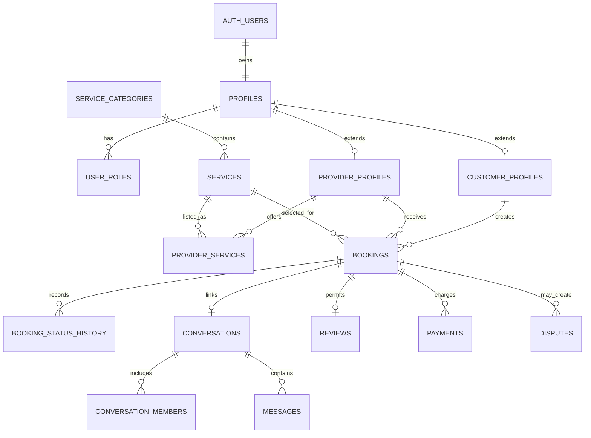

# Warsha database architecture

The Supabase/PostgreSQL schema is migration-first. The mobile app accesses it through `WarshaDataAdapter`; UI code must not embed table queries. Mock mode remains the safe development default.



## Migration order

1. `202607200001_core_marketplace.sql`: identities, catalog, provider marketplace, bookings, status history, constraints, indexes, and controlled cancellation.
2. `202607200002_operations.sql`: quotes, change orders, payments, chat, reviews, promotions, wallets, support, disputes, administration, and audit records.
3. `202607200003_security_storage.sql`: RLS, authorization helpers, policies, and public/private storage buckets.

Business states that are part of a workflow are constrained today. Frequently changing catalog values remain rows rather than PostgreSQL enums. Locations use latitude/longitude columns initially; PostGIS can be introduced later without changing client contracts.

## Local database

Install Docker Desktop and the Supabase CLI, then run:

```powershell
npx.cmd supabase start
npx.cmd supabase db reset
npx.cmd supabase test db
```

`db reset` is destructive to the local development database. It reapplies migrations and then the idempotent `supabase/seed.sql` catalog seed.
