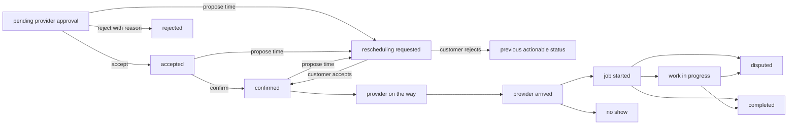

# Provider job flow

Provider job mutations are database-authoritative. The mobile app never supplies a provider or user identifier; every RPC resolves the caller with `auth.uid()`, finds that user’s approved and published provider profile, locks the assigned booking, and verifies the current status before changing it.

The existing booking audit trigger writes one history row only when the status actually changes. Provider RPCs annotate that trigger-created row with sanitized notes. The same trigger inserts an in-app notification for the other participant and suppresses duplicate event notifications.

Completion evidence is optional and limited to four images in the app. Files use the private `booking-attachments` bucket under `<provider-user-id>/<booking-id>/completion/`. Metadata distinguishes customer issue images from completion evidence. Only booking participants can read metadata and generate signed URLs. Failed multi-file uploads are cleaned up before the job remains actionable.

Live provider actions require `onboarding_status = 'approved'` and `is_published = true`. Mock mode uses a separate persisted local job collection so the complete UI can be exercised without weakening production authorization.
